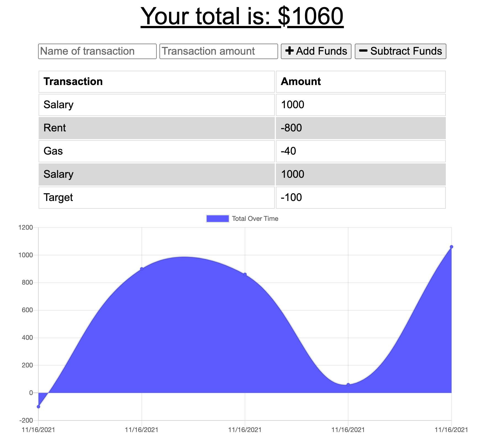

<h1 align="center">Progressive Budget</h1>

---

<h4 align="center">Boot Camp HW # 15: Progressive Budget Web Application</h4>

## Table of Contents

- [About](#about)
- [Installing](#installing)
- [Usage](#usage)
- [Built With](#built_using)
- [Authors](#authors)
- [Example URL Out](#example-url-out)
- [Questions](#questions)
- [Screenshots](#screenshots)

## 

- This application is a budget tracker. Users can add expenses and incomes and track them using a simple and intuitive UI.

## 

- HTML
- Bootstrap
- JavaSript
- Express.js
- Mongoose.js

## 

1. Navigate to the Heroku hosted [Progressive Budget](https://cleadi-progressive-budget.herokuapp.com/) application.
2. Enter an expense or an income amount using the empty number field box, then click to add or subject from your total budget.
3. A graph to show your budget will appear once an expense or income is added. You can then keep adding incomes or expenses and the page graph will dynamically adjust.

## 

- If you wish to reach me, feel free to send me an email at cleadi@fastmail.com
- I can also be reached via LinkedIn: https://www.linkedin.com/in/dillon-cleaver/
- GitHub profile: https://github.com/cleadi

## 

